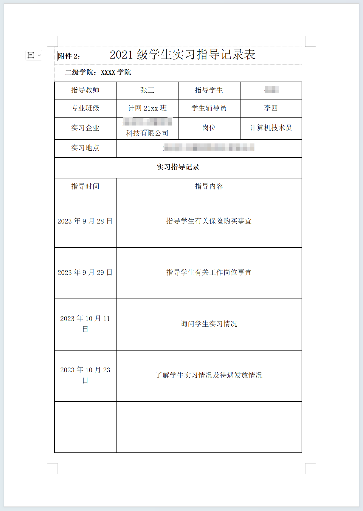
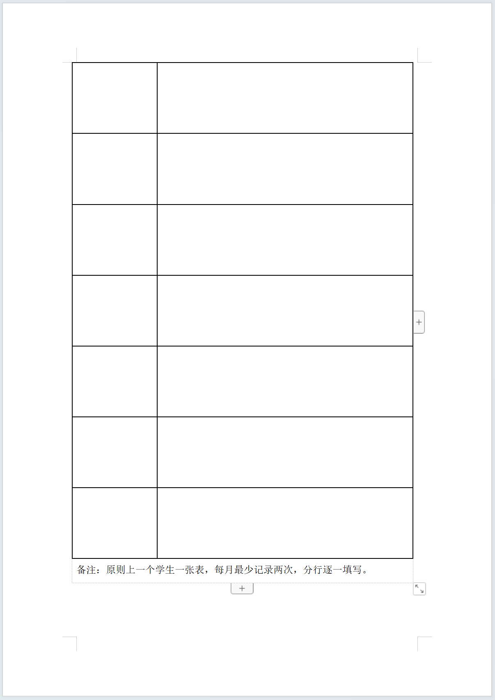
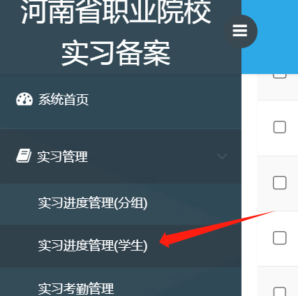
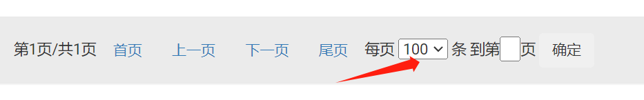
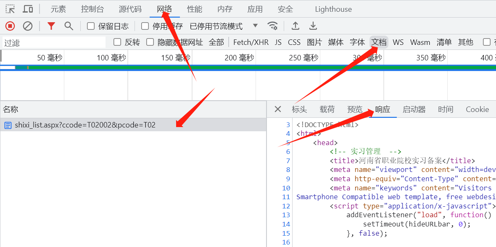
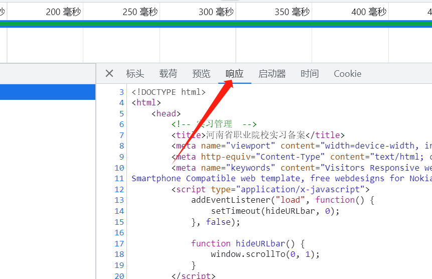
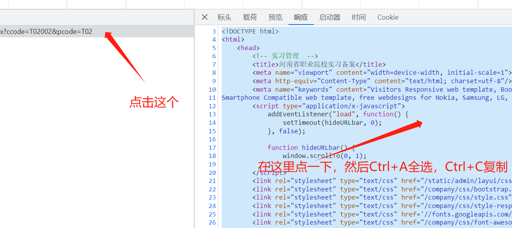
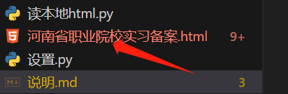
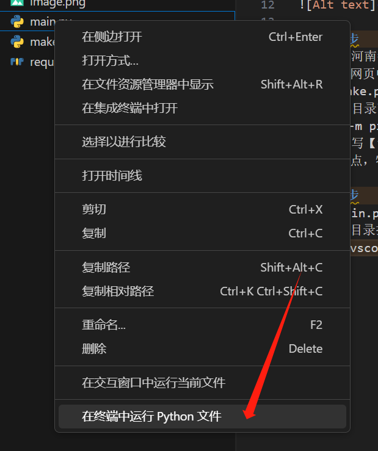
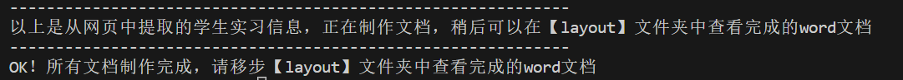

# 说明
>
> 最终生成的结果预览




---

## 第一步

### 1.打开职校家园，登录后切换到【实习进度管理(学生)】



### 2.底部选择每页100条，用来在一个页面放下所有学生。如果100条也放不下，那先整前100条，完成全部流程后下100条再来一次完整流程



### 3.打开页面调试（F12或者右键-检查/审查元素），切换到网络标签，然后在下面一行选择文档



### 4.在请求栏切换到【响应】便签





### 5.把里面显示的所有网页内容全选-复制-粘贴到这个文件同目录下的【河南省职业院校实习备案.html】中



## 第二步

### 1.可选
>
> 打开【河南省职业院校实习备案.html】，如果能看懂html可以看一下是不是所有学生都在网页中了

### 2.可选
>
> 检查make.py中的内容，可以定制，如果懂python和python-docx的话

### 3.☆重要

__☆需要安装过python，最好将python添加入环境变量☆__

> 我的版本是3.11.4，基本上是最新版的，按道理来说版本低点没事，不过最好还是装这个版本最好

> python的安装方法
>> <https://xinzhi.wenda.so.com/a/1521191912207484>

### 4
>
> 在当前目录下打开终端，执行

``` python
python -m pip install -r requirements.txt
```

### 5.修改填写【设置.py】中的一些简单信息

> 【设置.py】中有详细的说明。注意不要随便修改格式和标点，特别是不懂语法的时候

## 第三步

### 运行【main.py】

### 可以在本目录打开终端运行命令

`python main.py`

### 也可以在vscode中在文件上点右键运行



### 最终会在【layout】文件夹中生成结果



## 特别说明

### 暂时学生的实习地点还是用的公司名称，由于刚刚网页上没有实习地点，所以暂时以公司名称代替，后续如果可以用cookie直接访问了再改进
